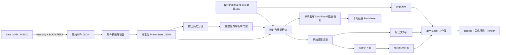

# 当前实现、架构和数据规则

## 1. 项目目标

将打印机自动发送到新浪邮箱的状态通知转换为可审计、可重复生成的 Excel 报表，逐步替代现有付费转换服务，并为后续计数器分析、设备监控和自动化打基础。

当前范围包括：

- 邮件提取与解析
- 客户及位置映射
- 耗材、服务部件、故障和计费器原始信息
- 单日和五日 Excel 报表
- 从 2026-06-01 开始、每日自动更新的本地运营 Dashboard
- 可审计的每日历史分区、修订版本和运行清单
- 与现有 Excel 样例的兼容性验证

当前不包括：

- 直接通过 SNMP 轮询打印机
- 根据计费器 `[1]-[5]` 自动判断黑白、彩色、复印和扫描
- 自动修改映射表
- 服务器级高可用调度、实时 Dashboard、告警推送和数据库数据仓库

## 2. 数据流程

## 3. 组件说明

### `retrieve_printer_mail.py`

- 从外部 `.env` 读取新浪账号和 IMAP 授权码。
- 以 `readonly=True` 打开 INBOX。
- 按 `SINCE`/`BEFORE` 搜索日期，并再次按 `Asia/Shanghai` 校验邮件时间。
- 使用 UID 批量读取邮件，单封邮件最大读取 512 KiB。
- 支持纯文本和 HTML 邮件。
- 支持以下标签和模板差异：
  - `产品名称`、`Product Model`、`Product Name`
  - `序列号`、`机身编号`、`Serial Number`
  - `耗材`、`消耗品`、`Consumables`、`Supplies`
  - `服务部件`、`更换部件`
  - `故障`、`Fault`、`Trouble`、`Error`
  - `计费器`、`计数器`、`Billing Meter`

### `printer_email_report.mjs`

- 读取一天的标准化状态 JSON。
- 使用映射表补充客户和位置。
- 生成全部通知记录和去重状态记录。
- 生成单独状态工作簿及三页签合并工作簿。
- 保留参考文件的列顺序、绿色表头、宋体 11 号、日期格式和换行方式。

### `five_day_printer_report.mjs`

- 当前针对五个固定自然日生成报表。
- 每日页展示当天不同状态。
- `信息汇总` 页按设备保留五日内最新状态，并统计通知数、活跃天数和状态数。
- `分析` 页展示邮件量、去重结果、设备排名、映射质量和计费器覆盖情况。

### `dashboard/`

- `build_data.mjs` 从全部每日历史 JSON 和客户映射表生成 `data.js` 快照。
- `index.html`、`styles.css` 和 `app.js` 提供无需后端的本地 Web Dashboard。
- 默认视图展示通知量、设备数、告警设备、计费器覆盖、日/周/月趋势和客户分布。
- 设备、告警、计费器和质量问题设备表支持全局筛选；质量卡片固定显示整份快照的发布基线。
- 计费器仅展示原始 `[1]-[5]` 数值，不推断黑白、彩色、复印或扫描含义。

### `update_printer_dashboard.py`

- 默认检查从 `2026-06-01` 到昨天的所有日期。
- 补抓缺失日并重抓最近 3 天，支持 IMAP 重试和首次回填并发。
- 按日保存邮件与标准化状态，内容变化前归档旧版本。
- 检查分区、UID、来源关系、日期和解析率，失败时保留上一版 Dashboard。
- 使用运行锁避免并发写入，并生成包含计数和 SHA-256 的运行清单。

## 4. 数据契约

### 原始邮件 `MailRecord`

| 字段 | 含义 |
|---|---|
| `uid` | IMAP UID，作为邮件来源标识 |
| `subject` | 解码后的主题 |
| `sender` / `recipient` | 发件人和收件人 |
| `message_date` | 邮件头时间，转换为上海时区 |
| `internal_date` | IMAP INTERNALDATE，作为备用时间 |
| `text` | 从纯文本或 HTML 提取的正文 |

### 标准化状态 `PrinterState`

| 字段 | 含义 |
|---|---|
| `uid` | 来源邮件 UID |
| `timestamp` | 状态时间 |
| `model` | 机器型号 |
| `serial` | 机身编号，逻辑上按文本处理 |
| `consumables` | 耗材原始状态 |
| `service_parts` | 服务部件原始状态 |
| `fault` | 故障原始状态 |
| `billing_meter` | 计费器原始状态 |

### Excel 状态表

九列顺序固定为：日期、客户名称、位置、机器型号、机身编号、耗材、服务部件、故障、计费器。

## 5. 当前业务规则

### 日期口径

- 生产逻辑按上海时区的完整自然日运行。
- Dashboard 周统计按周一至周日，月统计按自然月，首尾周期可能不完整。
- 自动任务只发布到昨天，避免把当天尚未结束的数据误当作完整日。
- 参考付费服务的 `对比文件.xlsx` 使用过跨日时间窗口，因此不能默认将它解释为完整自然日。
- 后续需要明确支持 `calendar-day` 和 `cutoff-window` 两种模式。

### 映射规则

- 机身编号是映射主键。
- 同一机身编号有多条候选时，优先选择客户和位置字段更完整的记录；分数相同则选择先出现的记录。
- 找不到客户或位置时，报表写入明确的占位提示，并在验证结果中列出机身编号。
- 映射表仍有重复编号和位置缺失，当前程序不会自动修改源文件。

### 状态去重

- 去重键包含客户、位置、型号、机身编号及四个状态字段，不包含时间。
- 相同状态多次出现时保留最新时间。
- 最终按时间倒序输出。
- 该规则用于压缩重复通知，不代表故障已解决；状态恢复需要依赖新的无故障通知或独立状态模型。

### 完整解析与旧服务兼容

- 当前解析器保留邮件中的“发生下列错误。”等前缀，也保留旧服务曾留空的有效耗材状态。
- 这提高了信息完整度，但不会与旧服务逐字符完全相同。
- 后续应提供 `complete` 和 `legacy-compatible` 两种明确模式，而不是在一个规则中混合处理。

## 6. 已验证基线

| 数据集 | 验证结果 |
|---|---|
| 2026-06-20 参考窗口 | 52 条邮件按时间到秒和机身编号全部匹配；客户、位置、型号、编号无差异 |
| 2026-06-20 去重 | 原始参考对比表去重后精确得到参考状态表的 11 行 |
| 2026-06-20 内容差异 | 56 个单元格差异，来自错误提示前缀和当前解析器保留的额外有效状态 |
| 2026-07-02 | 123 条通知、25 台设备、39 条去重状态；映射表页与源文件完全一致 |
| 2026-06-28 至 2026-07-02 | 787 封邮件全部解析；49 台设备；238 条每日去重状态 |
| 五日计费器 | 46 条计费器通知，覆盖 46 台设备；仅有 `[1]-[5]` 原始标签 |
| Dashboard 五日快照 | 787 条通知、49 台设备、238 条每日去重状态、215 条可操作告警/映射事件 |
| Dashboard 2026-06-01 至 2026-07-02 | 32 个日期分区；4,178 封邮件全部解析；50 台设备；6 月 3,843 条、7 月前两日 335 条 |

## 7. 已知问题

1. Excel 报表脚本仍有部分路径、日期范围和输出位置硬编码；Dashboard 已使用配置文件。
2. Python 与 JavaScript 中存在重复的映射和去重逻辑。
3. Dashboard 更新器已有基础单元测试，但邮件解析和 Excel 生成仍缺少完整的匿名化回归测试。
4. 映射表有重复机身编号、缺失位置，且编号在 Excel 中以数值存储。
5. 计费器 `[1]-[5]` 的含义会随型号变化，尚不能可靠映射到黑白、彩色、复印和扫描。
6. Dashboard 更新器已有重试、日期分区和运行锁，但尚未使用 IMAP UID 检查点，只按最近日期重抓。
7. 五日报表日期目前写在脚本中，无法直接指定任意起止日期。
8. 原始邮件和报表的保存周期、脱敏和访问控制尚未制度化。
9. `run_printer_email_report.sh` 仍偏向交互式运行，不适合无人值守调度。
10. Dashboard 已每日生成静态 `data.js`，但打开中的浏览器不会主动热更新，且尚无用户认证或服务端数据接口。
