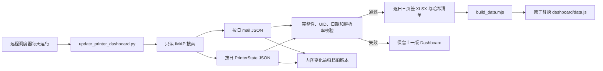

# Dashboard 历史与自动更新架构

## 1. 统计口径

- 历史起点：`2026-06-01`。
- 最新默认日期：上海时区的昨天，即最近完整自然日。
- 日：上海时区 `00:00:00` 至次日 `00:00:00`。
- 周：周一至周日；范围首尾可能是不完整周。
- 月：自然月。
- 通知数：解析成功的打印机邮件数。
- 状态数：同一自然日内按设备、客户、位置、型号及四类状态字段去重后的数量。

## 2. 更新流程



默认运行会：

1. 从 `2026-06-01` 到昨天检查所有日期分区。
2. 补抓缺失日期，并重抓最近 3 天以吸收延迟邮件。
3. 内容变化时，把旧文件保存到 `revisions/`。
4. 检查分区完整、UID 唯一、状态可追溯到源邮件、时间属于对应日期且解析率不低于 98%。
5. 质量门禁通过后，为缺失或输入变化的日期生成三页签 Excel；相同输入直接跳过，旧工作簿进入修订目录。
6. 每日 Excel 全部成功后才生成并原子替换 Dashboard 快照。

## 3. 历史目录

```text
data/printer_history/
├── daily/          # 每日 mail-* 与 printer-states-* JSON
├── revisions/      # 分区变化前的旧版本
├── runs/           # 每次成功运行的清单、计数和 SHA-256
├── logs/           # 可选的调度器日志目录
├── latest-run.json # 最近一次成功运行
├── last-failed-run.json
└── update.lock     # 防并发运行锁
```

每日分区是长期证据层；`dashboard/data.js` 是可随时重建的发布层。删除发布层不会丢失历史，运行 `python3 update_printer_dashboard.py --rebuild-only` 即可恢复。

```text
data/daily_reports/
├── YYYY-MM-DD/
│   ├── 打印机信息汇总-YYYY-MM-DD.xlsx
│   └── manifest.json
└── revisions/YYYY-MM-DD/  # 输入变化前的旧工作簿与清单
```

每日工作簿包含 `客户名称机身编号映射表`、`对比文件` 和 `打印机状态-YYYY-MM-DD-00001` 三个页签。清单记录源邮件、标准化状态、映射表、生成器和输出文件的 SHA-256。

## 4. 当前基线

2026-06-01 至 2026-07-03：

- 33 个日期分区及 33 份每日 Excel。
- 4,305 封源邮件，4,305 条成功解析，解析率 100%。
- 50 台设备。
- 6 月 3,843 条，7 月前三日 462 条。
- 原五日 2026-06-28 至 2026-07-02 仍为 787 条，与此前结果一致。

## 5. 调度与恢复

远程 systemd timer、cron 或容器 CronJob 每天调用：

```bash
python3 update_printer_dashboard.py --config /etc/printer-dashboard/dashboard_config.json
```

Linux systemd 和 Nginx 示例位于 `deploy/`。如果更新失败，命令返回非零状态并写入 `last-failed-run.json`，上一版 `dashboard/data.js` 保持不变；下一次运行会继续补缺口。

## 6. 后续演进

当历史规模或多人访问需求增长时，将每日 JSON 和 Excel 继续作为原始证据与人工核对层，同时把标准化事件增量写入 SQLite/PostgreSQL，由受认证 API 提供分页和聚合。当前 4,305 条规模下，静态快照仍适合单机内部使用。
